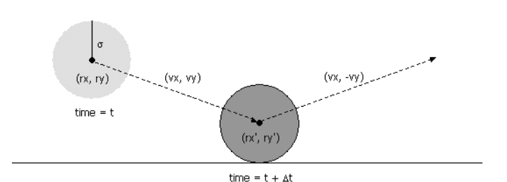
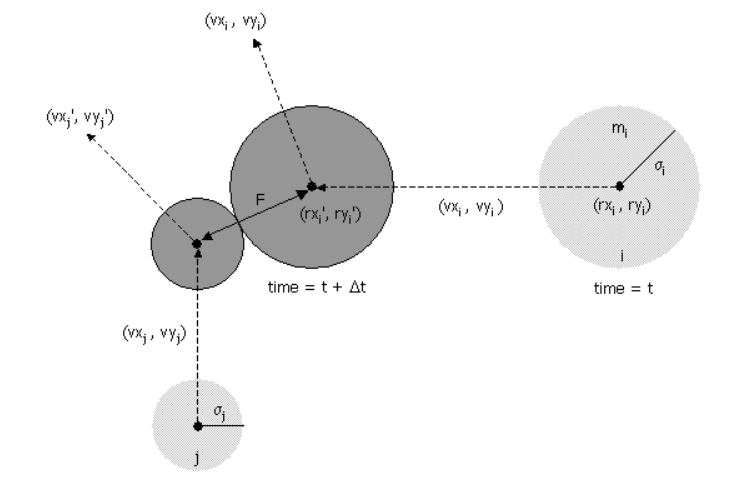
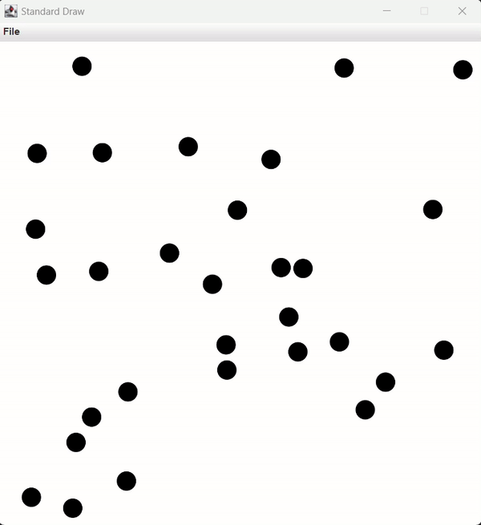

# Event-Driven Simulation

## Simulation

There are two natural approaches to simulating the system of particles.

### Time-Driven Simulation

In a time-driven simulation we have a variable recording the current time, which is incremented in fixed steps. After each increment we check to see which events may happen at the current time point, and handle those that do.

### Event-Driven Simulation

With event-driven simulation we focus only on those times at which interesting events occur. Our main challenge is to determine the ordered sequence of particle collisions. We address this challenge by maintaining a priority queue of future events, ordered by time. At any given time, the priority queue contains all future collisions that would occur, assuming each particle moves in a straight line trajectory forever. As particles collide and change direction, some of the events scheduled on the priority queue become "stale" or "invalidated", and no longer correspond to physical collisions. We adopt a lazy strategy, leaving such invalidated collision on the priority queue, waiting to identify and discard them as they are deleted. The main event-driven simulation loop works as follows:

Delete the impending event, i.e., the one with the minimum priority t.

* If the event corresponds to an invalidated collision, discard it. The event is invalid if one of the particles has participated in a collision since the time the event was inserted onto the priority queue.

* If the event corresponds to a physical collision between particles i and j:

  * Advance all particles to time t along a straight line trajectory.

  * Update the velocities of the two colliding particles i and j according to the laws of elastic collision.

  * Determine all future collisions that would occur involving either i or j, assuming all particles move in straight line trajectories from time t onwards. Insert these events onto the priority queue.

* If the event corresponds to a physical collision between particles i and a wall, do the analogous thing for particle i. 

This event-driven approach results in a more robust, accurate, and efficient simulation than the time-driven one.

 

## Collision Prediction And Resolution

### Collision between particle and a wall

Given the position (rx, ry), velocity (vx, vy), and radius σ of a particle at time t, we wish to determine if and when it will collide with a vertical or horizontal wall.

### Collision between two particles

Given the positions and velocities of two particles i and j at time t, we wish to determine if and when they will collide with each other.

 

The resolution of collision types can be calculated using the rules of momentum. Implementation of the resolution algorithm is straightforward from the formulas, as you see in the code.

 

## Testing

Now we simulate the movement of 30 particles using our code, resulting in a mesmerizing visualization of their interactions and emergent patterns.

Very impressive.

 
 

Mustafa Turgut    
mstftrgt00@gmail.com
